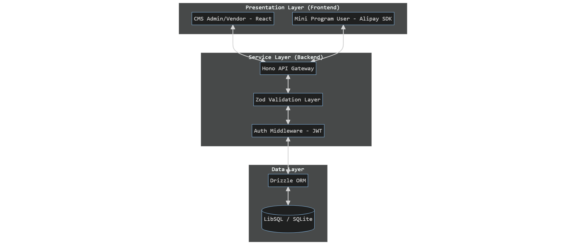
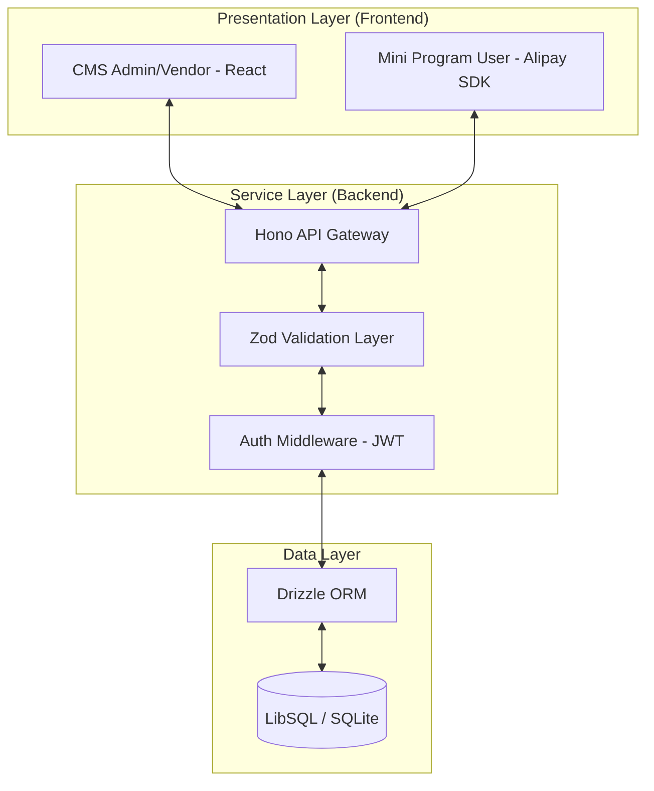
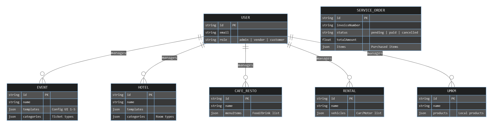
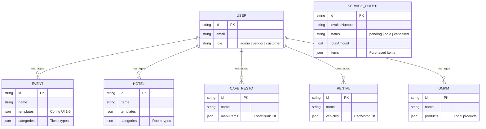
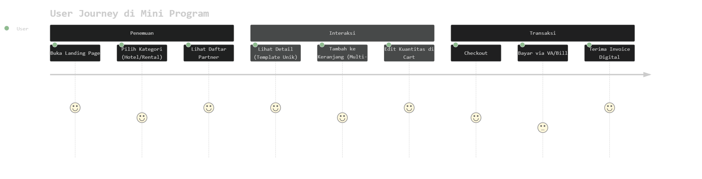
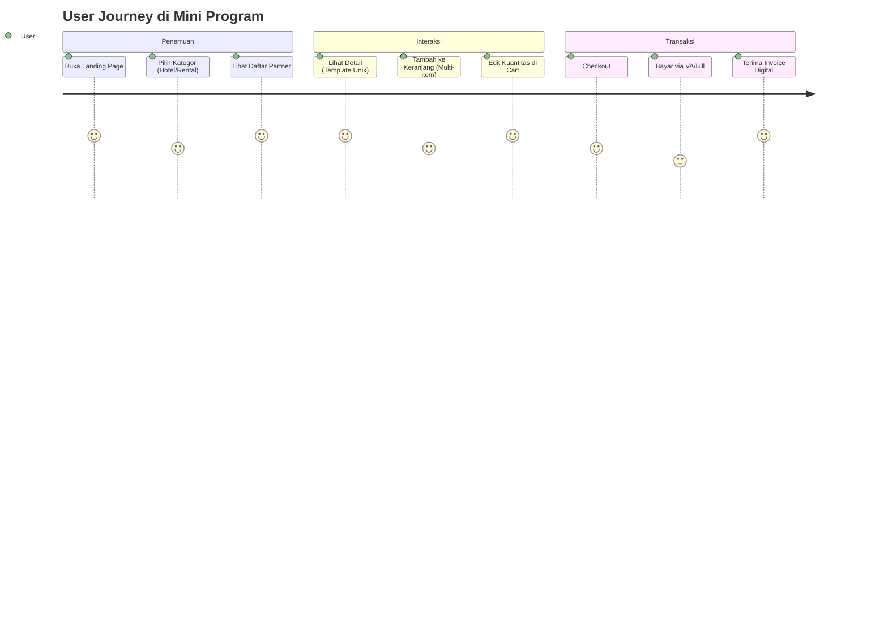
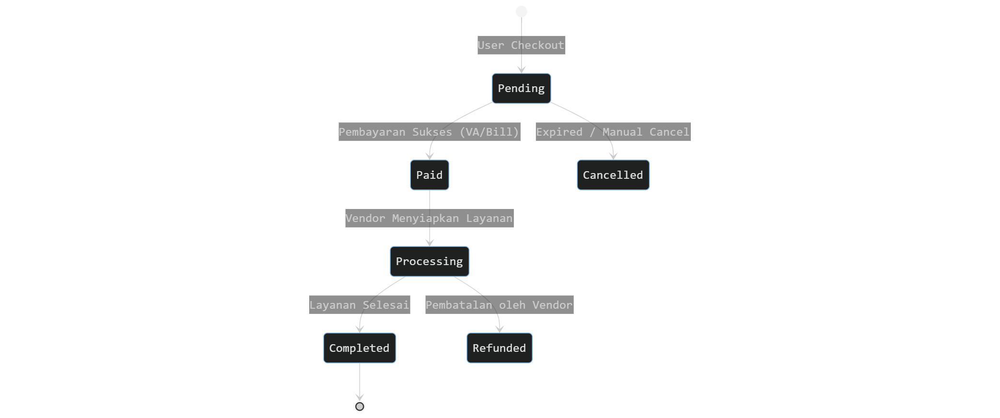
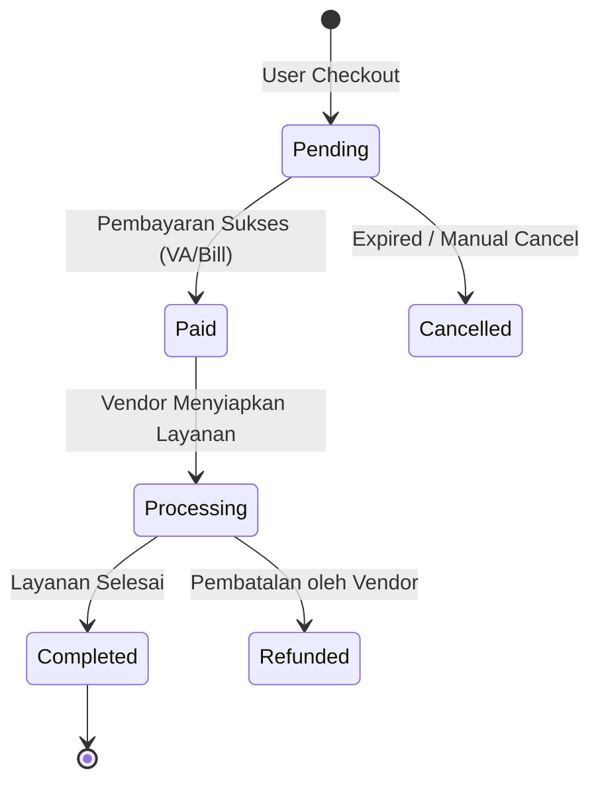

# Dokumentasi Teknis & Bisnis: mPaaS Template Management System

Sistem ini adalah solusi *end-to-end* untuk manajemen layanan multi-kategori (Event, Hotel, Culinary, Rental, UMKM) yang memungkinkan kustomisasi visual dinamis melalui sistem template.

---

## **1. High-Level Design (HDL)**

### **1.1 Arsitektur Global**
Sistem menggunakan pola **Decoupled Architecture** dimana CMS dan Mini Program berdiri sendiri dan berkomunikasi melalui Backend API yang tersentralisasi.





### **1.2 Ekosistem Bisnis**
Sistem ini dirancang untuk tiga pemangku kepentingan utama:
1.  **Admin**: Mengelola seluruh sistem, melihat statistik global, dan memvalidasi vendor.
2.  **Vendor**: Mengelola konten layanan mereka sendiri (misal: menu resto, daftar mobil) dan memilih template visual.
3.  **User (Customer)**: Menikmati pengalaman belanja yang dipersonalisasi di Mini Program dengan tampilan yang selalu *fresh* sesuai template pilihan vendor.

---

## **2. Low-Level Design (LDL)**

### **2.1 Entity Relationship Diagram (ERD)**
Struktur data dirancang untuk fleksibilitas tinggi menggunakan kombinasi kolom relasional dan field JSON untuk konfigurasi template.





### **2.2 Logic Flow: Dynamic Templating**
Pemisahan antara data konten dan konfigurasi visual.
1.  **Backend**: Mengirim data murni + `template_id`.
2.  **Mini Program**: Memiliki *Registry* komponen (Template 1 sampai 5).
3.  **Frontend Logic**: 
    ```javascript
    // Pseudocode di Mini Program
    const TemplateComponent = TemplateRegistry[data.templateId];
    return <TemplateComponent data={data} />;
    ```

---

## **3. Diagram Alur Bisnis (Business Flow)**

### **3.1 User Journey Map**
Perjalanan pengguna dari penemuan layanan hingga transaksi selesai.





### **3.2 Lifecycle Pesanan (Order State Machine)**
Menjelaskan transisi status transaksi untuk tim operasional/bisnis.






---

## **4. Spesifikasi Teknis (Tech Stack)**

| Layer | Technology | Alasan Penggunaan |
| :--- | :--- | :--- |
| **API Framework** | Hono (Node.js) | Ultra-fast, minimal overhead, support TypeScript. |
| **Database** | LibSQL | Kecepatan SQLite dengan fitur cloud-native. |
| **ORM** | Drizzle | Type-safe, ringan, dan performa query mendekati raw SQL. |
| **State Management** | TanStack Query | Caching data API yang handal di sisi CMS. |
| **Mini Program UI** | Ant Design Mini | Konsistensi desain standar industri mPaaS. |

---

## **5. Strategi Integrasi**

1.  **Autentikasi**: Menggunakan JWT yang dikirim via Header HTTP. CMS menyimpan token di *local storage*, Mini Program menggunakan `my.setStorage`.
2.  **Sinkronisasi Data**: Setiap perubahan di CMS (misal: ganti harga motor) akan langsung berdampak pada Mini Program saat halaman di-*refresh* (Real-time melalui API).
3.  **Invoice Engine**: Sistem di CMS memiliki *Print Engine* khusus menggunakan CSS `@media print` untuk menghasilkan invoice standar A4 dari data pesanan backend.

---

## **6. Panduan Pengoperasian (Operations)**

### **Cara Menambah Partner Baru (Bisnis)**
1.  Vendor melakukan registrasi di CMS.
2.  Vendor memilih kategori layanan (misal: Rental).
3.  Vendor menginput armada dan memilih salah satu dari **5 Template Premium**.
4.  Layanan otomatis tayang di Mini Program dalam kategori "Rental".

### **Pemeliharaan Data (Technical)**
- **Seeding**: Jalankan `npx tsx seed-real-life.ts` di folder backend untuk mereset data ke kondisi *Real-Life* (Ismaya, Astra, Marriot, dll).
- **Migrations**: Gunakan `npm run db:push` untuk memperbarui skema database tanpa kehilangan data.

---
*Dokumentasi ini bersifat hidup dan akan diperbarui seiring dengan perkembangan fitur sistem.*
